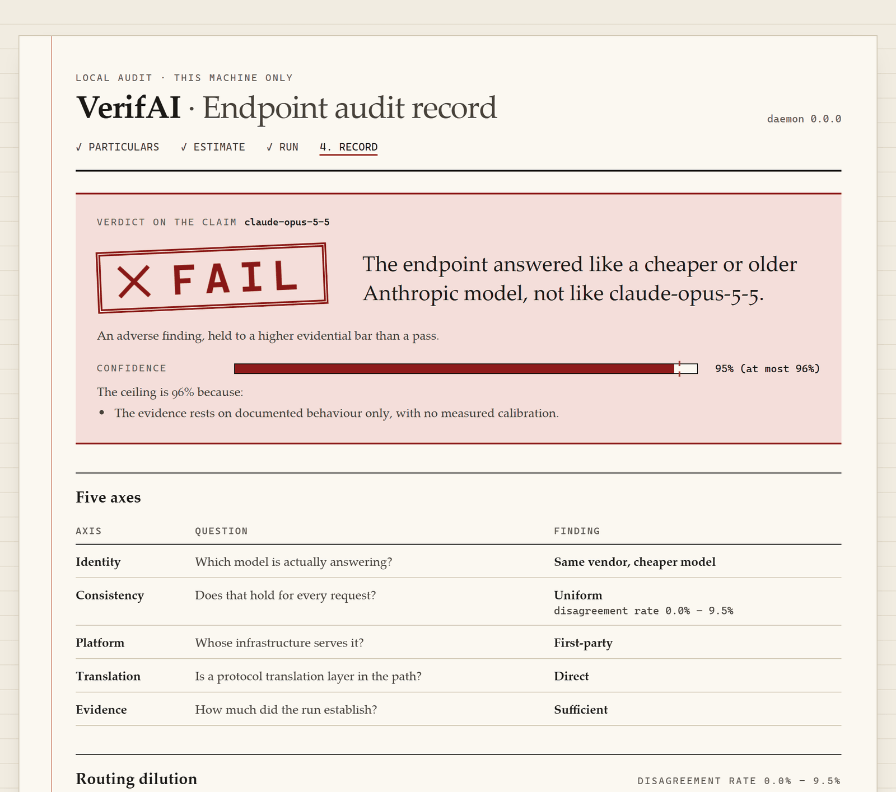
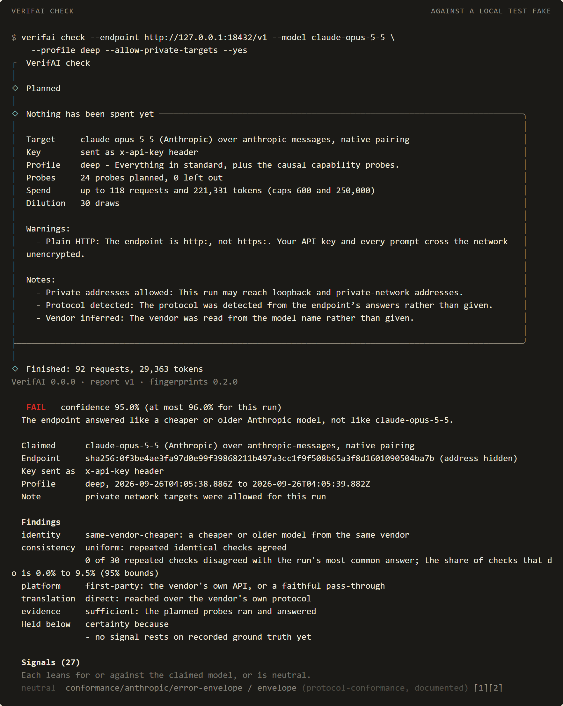
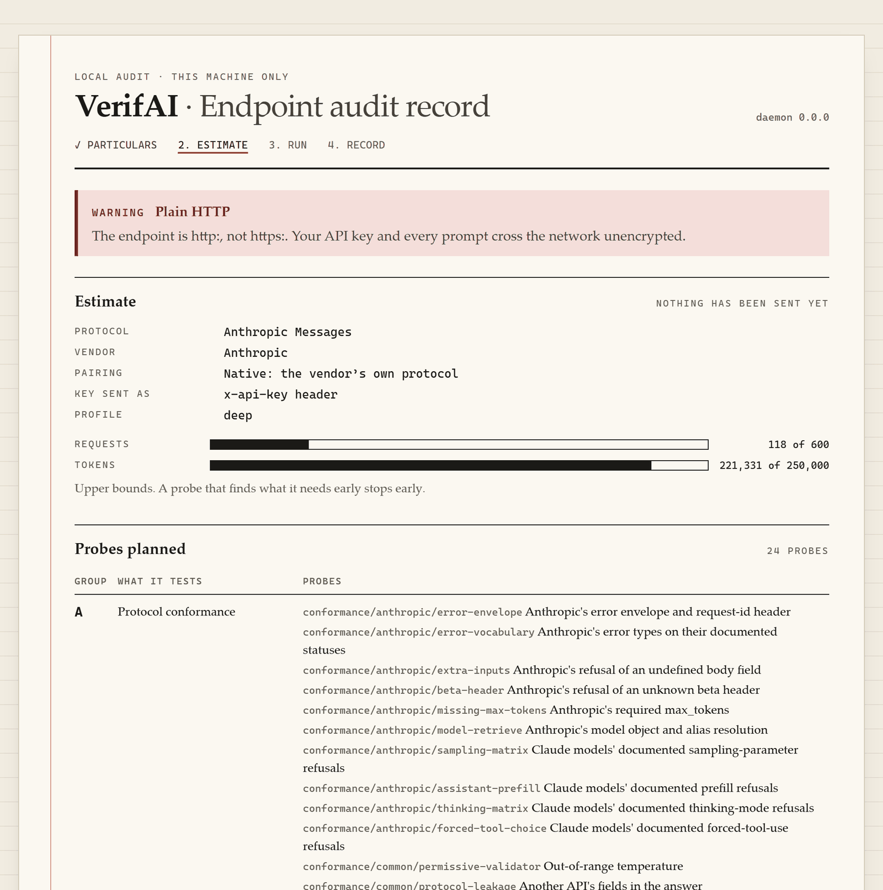
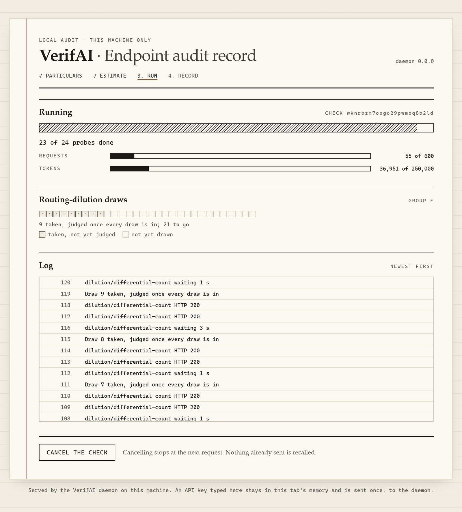
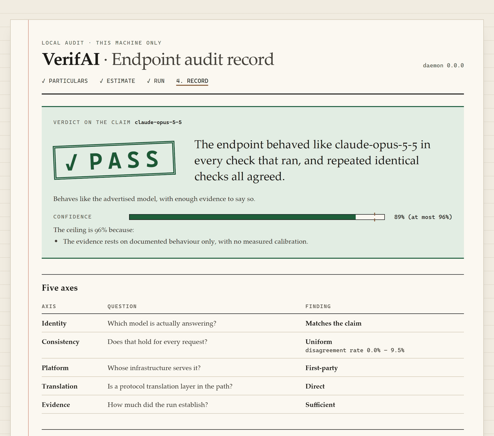
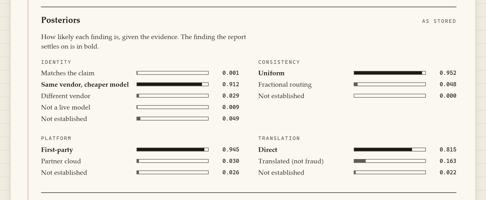
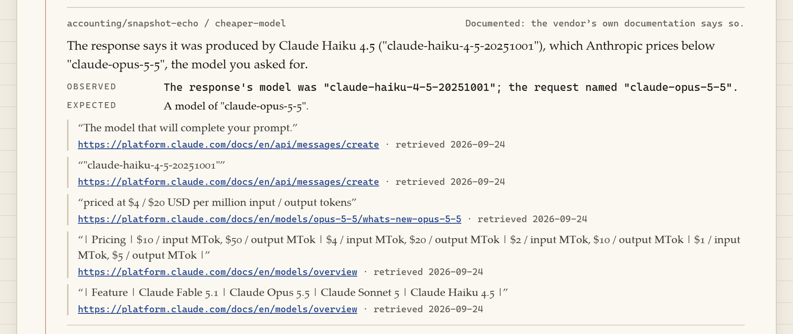
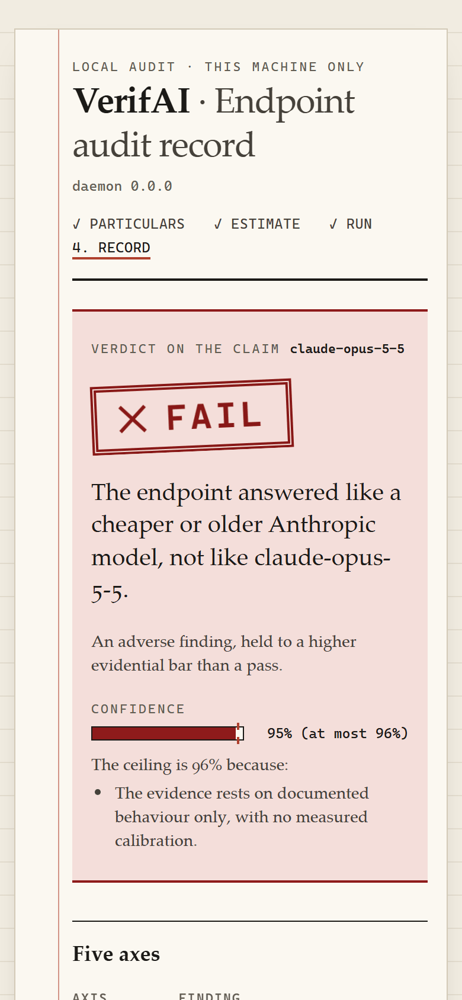

# VerifAI

**Cek apakah endpoint API "Claude" atau "GPT" dari pihak ketiga benar-benar melayani model yang mereka iklankan.**

[](https://github.com/ribdsp/VerifAI/actions/workflows/ci.yml)
[](LICENSE)

> 🇬🇧 [Read in English](README.md)



<sub>Pengecekan deep terhadap test fake `model-downgrade` milik repo ini sendiri, di mana Claude
Haiku 4.5 menjawab sebagai `claude-opus-5-5`. Bukan verdict untuk provider sungguhan mana pun;
selengkapnya di [Seperti apa sebuah pengecekan](#seperti-apa-sebuah-pengecekan).</sub>

Banyak reseller menjual akses murah ke model Claude dan GPT. Sebagian jujur. Sebagian
mengiklankan nama model mahal tapi diam-diam melayani sesuatu yang jauh lebih murah — model
kecil dari vendor yang sama, model dari vendor lain, atau model open-weight yang dipasangi
nama mahal. Pembeli yang cuma melihat teks balasan tidak punya cara untuk tahu.

VerifAI menerima endpoint, API key, dan nama model **milik Anda sendiri**, menjalankan
serangkaian probe terhadap endpoint itu, lalu mengeluarkan laporan bukti: perilaku mana yang
cocok dengan yang asli, mana yang tidak, dan kutipan dokumentasi resmi vendor yang
mendefinisikan apa yang seharusnya terjadi.

Semuanya jalan di komputer Anda. Tidak ada layanan VerifAI yang di-hosting, dan API key Anda
tidak pernah dikirim ke mana pun selain endpoint yang Anda uji sendiri.

**Status: masih tahap awal.** Fase 0–6 dari 8 sudah selesai: pengecekan di terminal, web UI
lokal, dan probe grup A–D serta F. Ekspektasinya diturunkan dari dokumentasi vendor; belum ada
yang dicocokkan dengan rekaman dari key resmi, jadi perlakukan verdict-nya sebagai petunjuk
yang bersumber jelas, bukan jawaban final. Belum ada di npm. Lihat [Roadmap](#roadmap).

---

## Yang TIDAK Diklaim VerifAI

Baca ini sebelum yang lain.

- **VerifAI tidak membuktikan penipuan.** Dia melaporkan sinyal dan mengutip dokumentasi.
  Laporannya adalah bukti teknis yang bisa Anda pakai sebagai pelanggan — bukan putusan
  hukum, dan bahasa laporannya memang disusun supaya tidak bisa disalahartikan sebagai itu.
- **Tidak ada metode berbasis software yang bisa memastikan identitas model.** Ini hasil
  penelitian yang dipublikasikan, bukan sikap sok rendah hati
  ([arXiv:2504.04715](https://arxiv.org/abs/2504.04715)). Model murah bisa di-fine-tune
  supaya meniru fingerprint model mahal
  ([arXiv:2606.16100](https://arxiv.org/abs/2606.16100)). VerifAI menaikkan biaya
  penipuan; dia tidak menghapusnya.
- **Translation gateway bukan penipuan.** Melayani model Claude asli lewat route berbentuk
  OpenAI itu bisnis yang sah — Anthropic sendiri
  [menjalankan satu](https://platform.claude.com/docs/en/cli-sdks-libraries/libraries/openai-sdk).
  VerifAI mencatatnya di sumbu `translation` tersendiri yang tidak pernah menggeser verdict.
  Yang dicari adalah **substitusi model** — dan memisahkan keduanya itu syarat, bukan
  pelengkap.
- **"Tidak bisa disimpulkan" bukan berarti aman.** Kalau endpoint memblokir probe, meng-nol-kan
  angka usage, atau menjawab terlalu seragam untuk dianalisis, bukti dicatat sebagai
  `obstructed` dan verdict-nya paling bagus **caution**. Endpoint yang menolak diperiksa itu
  lebih mencurigakan, bukan kurang.
- **Laporan bertanda tangan membuktikan keutuhan, bukan kebenaran.** `verifai verify`
  memastikan laporan tidak diubah setelah ditandatangani dan terikat pada pemegang kunci.
  Dia **tidak** membuktikan endpoint-nya benar-benar berperilaku begitu. Siapa pun bisa
  membuat kunci lalu menandatangani laporan karangan. Attestation sungguhan butuh TEE atau
  notaris, dan itu di luar cakupan — dinyatakan terang-terangan.
- **Database fingerprint akan basi.** Setiap vendor merilis model baru, targetnya bergeser.
  Karena itu data referensi jadi package terpisah yang berversi dan ber-schema, plus
  `verifai calibrate` — bukan angka yang di-hardcode di dalam mesin deteksi.

Apa saja yang bisa mengalahkan VerifAI, di mana dia bisa salah, dan siapa yang dirugikan
kalau dia salah: [`docs/threat-model.md`](docs/threat-model.md).
---

## Cara VerifAI mengambil keputusan

Hal yang menentukan semua sisanya: **VerifAI tidak menilai gaya bahasa.**
Gaya bahasa gampang dipalsukan dan mustahil dikalibrasi dengan jujur. Tulang punggungnya
adalah probe **kausal** dan **akuntansi** — perilaku yang cuma bisa direproduksi kalau model
di belakang endpoint itu benar-benar model yang diklaim.

| Grup | Yang diukur | Biaya |
|---|---|---|
| **A — Konformansi protokol** | Bentuk envelope error, quirk serializer per-route, string error persis sesuai dokumentasi, matriks penolakan parameter, keberadaan header | ~0 token; sebagian probe **tidak butuh API key sama sekali** |
| **B — Integritas akuntansi** | Invarian aritmetika usage, format ID, gema alias→snapshot, nullability field per-generasi, invarian stream SSE | Murah |
| **C — Forensik tokenizer** | Hitungan token yang dihitung lokal vs yang dilaporkan; protokol diferensial untuk sisi yang tidak punya tokenizer publik | Hampir gratis — endpoint `count_tokens` Anthropic tidak ditagih |
| **D — Kapabilitas kausal** | Binding signature extended thinking, tangga ambang prompt-cache, bukti token-ID via `logit_bias`, re-tokenisasi `logprobs` | Yang menentukan; ditagih |
| **E — Perilaku & konsistensi lintas model** | Divergensi distribusi jawaban; tes *model-collapse* yang menjalankan baterai sama ke beberapa model yang diiklankan di satu endpoint | Ditagih, bobot terendah |
| **F — Routing dilution (ε)** | Apakah hanya **sebagian** trafik yang sampai ke model yang diiklankan | Opt-in |

Grup F penting karena semua verdict biner cocok/tidak-cocok melewatkan penipuan yang paling
rasional secara ekonomi: kirim 30% request ke model asli, sisanya ke yang murah. VerifAI
mengulang satu probe deterministik pengungkap-identitas sebanyak N kali — probe yang
jawabannya sama di API vendor sendiri, di partner cloud, maupun di balik lapisan terjemahan —
dan tingkat ketidakcocokan yang berada di antara 0 dan 1 adalah bukti adanya campuran.
Hasilnya dilaporkan sebagai ε̂ dengan interval keyakinan, dan campuran yang sudah terbukti
membuat endpoint gagal, karena "asli 70% waktu" bukan asli. Menyebar satu model asli ke
beberapa platform bukan campuran, dan tidak dibaca sebagai campuran.

Setiap laporan menjawab tiga pertanyaan lewat lima sumbu: **siapa yang menjawab**
(`identity`, `consistency`), **lewat jalur apa request-nya sampai** (`platform`,
`translation`), dan **apa yang membatasi pengukuran** (`evidence`). Verdict hijau / kuning /
merah diturunkan dari sumbu-sumbu itu, dan `platform` serta `translation` tidak pernah
menggesernya.

Bukti digabung sebagai **log-odds dengan plafon per-famili**: dua puluh probe string error
yang saling berkorelasi tidak boleh menumpuk jadi keyakinan palsu — dan banyak string error
vendor memang berasal dari satu validator yang sama. Confidence juga **dibatasi oleh
coverage** — kalau cuma probe gratis yang jalan, laporannya bilang begitu dan tidak boleh
terdengar lebih yakin dari buktinya. Apa yang diukur setiap grup probe dan alasannya ada di
[`docs/methodology.md`](docs/methodology.md); cara pengukuran itu menjadi verdict ada di
[`docs/scoring.md`](docs/scoring.md).

**Pengakuan model tentang identitasnya sendiri berbobot nol, ke arah mana pun.** Model rutin
salah menyebut dirinya sendiri ([arXiv:2411.10683](https://arxiv.org/abs/2411.10683)). Tidak
ada jalur dari self-identification ke perhitungan skor, dan itu ditegakkan lewat unit test,
bukan lewat kesepakatan.

---

## Seperti apa sebuah pengecekan

Semua gambar di sini adalah run sungguhan dari build repo ini, diambil dengan Playwright; gambar
terminal adalah rekaman run `verifai check` yang diputar ulang di xterm.js dan dipotong setelah
sinyal pertama. Tidak satu pun yang merupakan verdict untuk provider sungguhan: endpoint-nya dua
fake dari test suite, dilayani di loopback dan dihubungi dengan key karangan, dan semua run
memakai profil `deep`. `thin-pass-through` adalah Claude asli tanpa perantara;
`model-downgrade` membuat Claude Haiku 4.5 menjawab sebagai `claude-opus-5-5`. Keduanya ada di
tabel [Akurasi, yang diukur](#akurasi-yang-diukur).

**Dari terminal.** `verifai check` mencetak estimasi dan bertanya dulu sebelum mengirim apa pun,
lalu memberikan verdict, lima sumbu, dan setiap sinyal. Endpoint disebut lewat hash-nya, kecuali
Anda memakai `--show-endpoint`.



**Tidak ada yang dikirim sebelum Anda setuju.** Web UI menghitung biaya run lebih dulu: probe
yang direncanakan, batas atas request dan token yang boleh dipakai, dan peringatan kalau
endpoint-nya HTTP biasa.



**Selama berjalan.** Progres terhadap kedua batas, setiap draw routing-dilution begitu masuk, dan
log setiap probe.



**Penjual yang jujur lolos.** Fake yang asli, dengan klaim yang sama.



**Bagaimana setiap sumbu ditimbang.** Setiap sumbu menunjukkan seberapa besar kemungkinan tiap
temuan berdasarkan buktinya, dan temuan yang dipilih laporan dicetak tebal. Untuk fake
downgrade, *vendor sama, model lebih murah* keluar di angka 0,912.



**Setiap sinyal mengutip kata-kata vendor sendiri.** Di sini field `model` pada respons menyebut
Claude Haiku 4.5, dan laporan mengutip dokumentasi Anthropic tentang arti field itu dan harga
tiap model.



**Di ponsel.** Laporan yang sama, pas di layar 390 piksel.



---

## Instalasi

Belum dipublikasikan. Untuk jalan dari source:

```bash
git clone https://github.com/ribdsp/VerifAI.git
cd VerifAI
pnpm install
pnpm run build
node packages/cli/dist/bin.js --version
```

Butuh Node.js ≥ 22.18. `pnpm run build` membangun semua package sesuai urutannya dan menyalin
web UI ke samping CLI; kalau salinan itu tidak ada, `verifai web` mengatakannya terus terang.
Contoh di bawah menulis `verifai` untuk `node packages/cli/dist/bin.js`.

## Pemakaian

```bash
verifai          # di terminal: pilih antara pengecekan di terminal atau web UI
verifai check    # cek endpoint dari terminal ini; yang tidak diisi akan ditanyakan
verifai web      # pengecekan yang sama di browser, dilayani dari 127.0.0.1
verifai help check
```

### API key

Key dibaca dari `VERIFAI_API_KEY`, atau ditanyakan dengan input tersembunyi kalau variabel itu
kosong. Key tidak pernah diterima sebagai flag: `--api-key` dan yang mirip dengannya ditolak
sebelum apa pun dikirim, karena flag masuk ke history shell dan ke daftar proses.

### `verifai check`

Di terminal, setiap pertanyaan punya default, dan estimasi ditampilkan sebelum ada yang
dibelanjakan. Untuk script, isi `--endpoint`, `--model`, dan `--yes`:

```bash
export VERIFAI_API_KEY=...   # atau biarkan kosong supaya ditanyakan
verifai check \
  --endpoint https://reseller.example.com/v1 \
  --model claude-opus-5-5 \
  --profile standard \
  --format json --out report.json --yes
```

| Flag | Arti |
|---|---|
| `--endpoint <url>` | Base URL yang Anda terima, misalnya `https://gateway.example/v1` |
| `--model <nama>` | Model yang dijual ke Anda, misalnya `claude-opus-5-5` |
| `--vendor <vendor>` | `auto` (default), `anthropic`, atau `openai` |
| `--protocol <protokol>` | `auto` (default), `anthropic-messages`, `openai-chat`, atau `openai-responses` |
| `--profile <profil>` | `quick`, `standard` (default), `deep`, atau `paranoid` — lihat [Profil biaya](#profil-biaya) |
| `--max-requests <n>` | Berhenti merencanakan setelah sekian request (1–2000) |
| `--max-tokens <n>` | Berhenti merencanakan setelah sekian token (0–2.000.000) |
| `--spread <durasi>` | Sebar repetisi Grup F selama, misalnya, `90s` atau `10m` (maksimal `60m`) |
| `--allow-private-targets` | Izinkan endpoint di jaringan Anda sendiri, hanya untuk run ini; dicatat di laporan |
| `--show-endpoint` | Tampilkan alamat endpoint di laporan, bukan hanya hash-nya |
| `--format <format>` | `terminal` (default), `markdown`, atau `json` |
| `-o, --out <file>` | Tulis laporan ke file, bukan ke stdout |
| `-y, --yes` | Jalan tanpa minta konfirmasi estimasi |

Endpoint `http://` biasa tetap dicek, dengan peringatan di laporan: key Anda melintasi jaringan
tanpa enkripsi.

### Exit code

Script bisa bercabang berdasarkan hasilnya tanpa mem-parse laporan.

| Kode | Nama | Arti |
|---|---|---|
| `0` | pass | Berperilaku seperti model yang diiklankan, dengan bukti yang cukup |
| `10` | caution | Ada yang belum terjawab — **bukan** jaminan aman |
| `11` | fail | Ada temuan yang merugikan |
| `2` | usage | Command line atau inputnya salah; tidak ada probe yang dijalankan |
| `3` | stopped | Endpoint menolak key atau modelnya, atau tidak bisa dihubungi |
| `1` | internal | VerifAI sendiri yang gagal; tidak ada kesimpulan |
| `130` | cancelled | Ctrl+C, atau konfirmasi ditolak |

Kalau VerifAI gagal secara internal, dia mencetak pesan tetap, tidak pernah teks error-nya
sendiri, yang bisa saja membawa balasan endpoint atau key. Set `VERIFAI_DEBUG=1` untuk
menambahkan nama error dan stack frame-nya — tetap tanpa pesannya — saat melaporkan bug.

### `verifai web`

```bash
verifai web                          # port bebas, dan browser Anda membuka link-nya
verifai web --port 8080 --no-open    # cetak link-nya saja
```

Halamannya melakukan persis yang dilakukan `verifai check`, dengan probe dan laporan yang
sama, yang bisa diunduh sebagai JSON atau Markdown. Ctrl+C menghentikan server; semua
pengecekan yang dipegangnya, dan semua key, ikut hilang.

Server-nya lokal dan diperkeras seolah jaringannya bermusuhan:

- Hanya listen di `127.0.0.1`, dan hanya menjawab request yang header `Host`-nya menyebut
  listener itu, sehingga DNS rebinding patah. Request browser lintas-situs ditolak.
- Link-nya membawa token sesi yang diambil untuk proses ini, setelah `#`, jadi tidak pernah
  sampai ke log server, `Referer`, atau history. Setiap panggilan API wajib menyertakannya;
  `verifai web` yang baru mencetak token baru. Percobaan yang gagal dibatasi lajunya.
- Hanya satu pengecekan yang jalan dalam satu waktu. Pengecekan yang sudah diestimasi tapi
  tidak pernah dimulai dibuang, beserta key-nya, setelah 10 menit. Tidak ada yang ditulis ke
  disk.
- Halamannya dilayani dengan Content Security Policy yang ketat, tanpa framing dan tanpa
  referrer, dan API-nya sama sekali tidak mengirim header CORS.
- `--allow-private-targets` mati kecuali `verifai web` sendiri dijalankan dengan flag itu.
  Halaman tidak bisa menyalakannya, dan flag itu tidak pernah dibaca dari file config.

### Profil biaya

| Profil | Cakupan | Biaya khas |
|---|---|---|
| `quick` | Grup A saja — tidak bisa meloloskan endpoint, paling bagus **caution** | ~0 token |
| `standard` (default) | Grup A–C + Grup F (30 repetisi) | Mendekati nol — `count_tokens` gratis, request malformed ditolak sebelum inferensi |
| `deep` | + Grup D (dan Grup E, setelah masuk di Fase 7) | Ditagih; diestimasi dan dikonfirmasi sebelum apa pun dijalankan |
| `paranoid` | `deep` dengan urutan probe diacak, Grup F disebar selama 10 menit | Paling mahal; paling sulit di-special-case |

Planner mencetak estimasi token dan request lalu minta konfirmasi sebelum ada yang dibelanjakan.
`--spread <durasi>` menyebar Grup F ke rentang yang lebih panjang di profil mana pun yang
menjalankannya, dengan biaya waktu tunggu.

### Kalau bisa, pakai protokol bawaan vendornya

Protokol wire sebuah endpoint dan vendor model yang diklaimnya itu dua hal terpisah, dan
reseller mencampurnya bebas. VerifAI memverifikasi keempat kombinasinya, tapi:

| Vendor yang diklaim | Protokol yang dianjurkan | Alasan |
|---|---|---|
| Anthropic | `anthropic-messages` | Bawaan vendor. Katalog probe penuh, plafon confidence tertinggi. |
| OpenAI | `openai-chat` atau `openai-responses` | Sama. |

Mode lintas-protokol (Claude di `/v1/chat/completions`, GPT di `/v1/messages`)
**didukung, tidak ditolak** — tapi lapisan terjemahan pasti menghapus sinyal khas vendor,
jadi run seperti itu dapat plafon confidence lebih rendah. Kalau reseller Anda menyediakan
dua route, uji yang bawaan.

---

## Laporan, tanda tangan, dan registry

Saat ini laporan dirender untuk terminal, sebagai Markdown, atau sebagai JSON; bentuk JSON-nya
dijelaskan di [`docs/report-format.md`](docs/report-format.md). Tanda tangan dan registry
adalah Fase 8 dan **belum dibangun**; berikut rancangannya.

`verifai check` akan menulis `report.verifai.json`: dokumen JSON yang dikanonikalisasi (RFC 8785),
di-hash SHA-256, lalu ditandatangani dengan kunci Ed25519 yang dibuat lokal (`verifai keygen`,
disimpan di `~/.verifai/keys`). `verifai verify <file>` akan memeriksanya **sepenuhnya offline**.

Tanda tangan mencakup nonce probe, **digest** respons (bukan body-nya — itu keputusan privasi),
timing, serta versi tool dan database. Setiap field dijelaskan di
[`docs/report-format.md`](docs/report-format.md). Baca ulang
[Yang TIDAK Diklaim VerifAI](#yang-tidak-diklaim-verifai) untuk memahami nilai sebuah tanda
tangan.

Registry publiknya adalah **repository git**, bukan server: satu ringkasan laporan
bertanda tangan per baris JSONL, dikirim lewat pull request. `verifai registry sync` menarik
tarball; `verifai registry lookup <url>` menghitung hash identitas endpoint yang dinormalisasi
lalu mencari **secara lokal**. Identitas endpoint disimpan dalam bentuk hash secara default,
jadi registry bisa **di-lookup** tapi tidak bisa **dijelajahi sebagai daftar hitam**. UI-nya
menampilkan "N laporan independen dari M penanda tangan berbeda", bukan satu laporan sebagai
kebenaran. Lihat [`docs/registry.md`](docs/registry.md), serta `POLICY.md` di repository
registry untuk moderasi dan takedown.

## API key Anda

- Hanya disimpan **di memori**. Tidak pernah ditulis ke disk, tidak ke `localStorage`, tidak
  ke log, tidak ke laporan.
- Dimasukkan lewat environment variable atau prompt interaktif. Di web UI, key dikirim dari
  halaman ke server lokal lewat loopback, dan hanya tinggal di sana untuk satu pengecekan itu.
- Diredaksi dari semua output, termasuk pesan error.
- Dikirim ke tepat satu tempat: endpoint yang Anda minta VerifAI uji.

Daemon lokalnya me-resolve DNS lalu **mem-pin hasilnya ke socket** (mematahkan DNS
rebinding), menolak rentang alamat privat, loopback, link-local, dan metadata cloud —
termasuk IPv4-mapped IPv6 dan NAT64 — mematikan pengikutan redirect, dan menormalkan error
upstream ke taksonomi tetap sebelum ditampilkan, supaya VerifAI tidak bisa dijadikan port
scanner jaringan internal. Dia bind ke loopback, butuh token sesi per-proses, dan
memverifikasi header `Origin` tanpa CORS wildcard.

VerifAI tidak mengirim probe berkonten berbahaya. Semua probe hanya menyentuh permukaan
protokol dan perilaku kapabilitas.

---

## Provenance dan lisensi

MIT, clean-room. Nol kode deteksi pihak ketiga — bukan sebagai dependensi, bukan sebagai
referensi. Perilaku yang diharapkan setiap probe diturunkan dari dokumentasi resmi vendor
(URL plus kutipan verbatim), paper yang dipublikasikan, atau pengukuran kami sendiri, dan
semuanya dicatat di [`docs/PROVENANCE.md`](docs/PROVENANCE.md). Probe tanpa catatan
provenance akan gagal di CI.

Itulah kenapa VerifAI boleh dipakai siapa pun, termasuk vendor dan proyek komersial, dan
kenapa klaimnya bisa diaudit ketimbang harus dipercaya begitu saja.

## Akurasi, yang diukur

Matriks server palsu adversarial adalah bagian dari test suite. Setiap server palsu dibangun
dari fakta vendor yang terdokumentasi, tidak pernah dari id probe atau nonce, dan seluruh
katalog probe dijalankan terhadapnya dari ujung ke ujung dengan profil `deep`. Untuk
mereproduksi: `pnpm exec vitest run packages/core/test/accuracy.test.ts`. Model yang
diklaim adalah `claude-opus-5-5`, kecuali di dua baris GPT, yang mengklaim
`gpt-5.2-2025-12-11` lewat OpenAI Chat Completions.

| Server palsu | Apa itu | Headline | Confidence | Isi laporan | Target tercapai |
|---|---|---|---|---|---|
| `thin-pass-through` | Claude asli, tanpa perantara | `pass` | 0,89 | `matches-claim`, `uniform`, `direct` | ya — tes false-positive |
| `legit-translation-gateway` | Claude asli di balik OpenAI Chat Completions | `caution` | 0,30 | identity `unknown`, `translated` | **sebagian** — tidak dituduh, tapi juga belum diloloskan |
| `openai-translated` | GPT di balik bentuk Anthropic | `caution` | 0,69 | `different-vendor`, `translated` | tertangkap, sebagai `caution` alih-alih `fail` |
| `model-downgrade` | Haiku menjawab sebagai Opus | `fail` | 0,95 | `same-vendor-cheaper`, `direct` | ya |
| `model-downgrade`, GPT | GPT-5 mini menjawab sebagai GPT-5.2, nama model di setiap jawaban diganti | `caution` | 0,52 | `same-vendor-cheaper`, `direct` | tertangkap, sebagai `caution` alih-alih `fail` |
| `signature-forger` | Tidak pernah memverifikasi signature thinking yang diputar ulang | `fail` | 0,96 | `different-vendor`, digugurkan D1 | ya |
| `fractional-router` ε = 0,1 | 10% request dikirim ke Haiku | `fail` | 0,96 | `fractional`, 5 dari 30 cek, 7,3%–33,6% | ya — harapan 19,0% |
| `fractional-router` ε = 0,3 | 30% request dikirim ke Haiku | `fail` | 0,96 | `fractional`, 14 dari 30 cek, 30,2%–63,9% | ya — harapan 51,0% |
| `fractional-router` ε = 0,7 | 70% request dikirim ke Haiku | `fail` | 0,96 | `fractional`, 17 dari 30 cek, 39,2%–72,6% | ya — harapan 51,0% |
| `evasive` | Usage di-nol-kan, probe diblokir | `caution` | 0,80 | `evidence: obstructed` | ya — tidak pernah `pass` |
| `thin-pass-through`, GPT | GPT-5.2 asli, tanpa perantara | `caution` | 0,45 | `matches-claim`, `uniform`, `direct` | **sebagian** — tidak dituduh, tapi juga belum diloloskan |

Dalam hitungan: **8 dari 8** run adversarial tidak diloloskan (5 `fail`, 3 `caution`), dan
**0 dari 3** backend asli digagalkan; 1 dari 3 diloloskan. Ini hitungan atas matriks tetap
berisi server palsu yang deterministik, bukan rate yang punya bobot statistik, dan server palsu
hanya sesetia dokumentasi yang menjadi dasarnya. Kalibrasi terhadap endpoint nyata adalah Fase 7.

Yang tidak disembunyikan tabel ini:

- **Gateway yang sah belum diloloskan.** Claude yang disajikan lewat OpenAI Chat Completions
  belum punya referensi tokenizer yang terukur, jadi tidak ada bukti menentukan tentang siapa
  yang menjawab, dan VerifAI menyatakan `unknown` alih-alih menebak. Merekam referensi itu
  adalah Fase 7.
- **GPT asli belum diloloskan.** OpenAI mendokumentasikan satu set penolakan yang membedakan
  model-modelnya: kombinasi reasoning effort dan `temperature` mana yang ditolak tiap model
  (`conformance/openai/reasoning-matrix`). GPT-5.1 lebih murah dan menjawab semuanya persis
  seperti GPT-5.2, jadi bukti itu sama kuatnya untuk model yang lebih murah seperti untuk
  klaimnya. VerifAI membaca klaim sebagai jawaban yang lebih mungkin, tanpa meloloskannya.
- **Downgrade GPT hasilnya `caution`, bukan `fail`.** Matriks yang sama adalah satu-satunya
  bukti yang membedakan GPT-5 mini dari GPT-5.2: GPT-5 mini menolak reasoning effort `none`,
  yang menurut dokumentasi OpenAI diterima GPT-5.2. Satu penolakan terdokumentasi itu
  memberatkan klaim dan menunjuk ke model GPT-5 yang lebih lama, tapi belum cukup untuk
  menggugurkan GPT-5.2 sendirian.
- **`openai-translated` hasilnya `caution`, bukan `fail`.** Hitungan o200k_base menunjuk ke
  vendor lain, tapi bukti itu diturunkan, bukan diukur, dan lapisan terjemahan yang menghitung
  ulang token sendiri akan menunjukkan hitungan yang sama. Tidak ada yang menggugurkan klaim,
  jadi yang masih belum terjawab tidak dibebankan ke penjual.
- **ε̂ menghitung pengulangan, bukan request.** Satu cek Grup F terdiri dari dua request, dan
  cek itu terbaca sebagai mayoritas hanya kalau keduanya sampai ke model yang sama, jadi router
  yang mengirim 10% request ke tempat lain menampilkan sekitar 19% cek yang tidak sepakat. Kolom
  "harapan" adalah bagian itu, 1 − max((1−ε)², ε²). Lihat
  [`docs/scoring.md`](docs/scoring.md#4-dispersion-clamp-for-fractional-consistency).

## Roadmap

| Fase | Isi | Status |
|---|---|---|
| 0 | Workspace, toolchain, lisensi, harness provenance, CI | selesai |
| 1 | Transport, SSRF guard, parser SSE, tiga adapter protokol | selesai |
| 2 | Grup A — probe gratis. **Di sini VerifAI mulai berguna.** | selesai |
| 3 | Mesin skoring dan renderer laporan | selesai |
| 4 | Grup B dan C | selesai |
| 5 | Grup D | selesai |
| 6 | Launcher CLI dan web UI yang di-embed | selesai |
| 7 | Grup E, kalibrasi Grup F, `verifai record`, `verifai calibrate` | berikutnya |
| 8 | Tanda tangan, registry, rilis | |

## Kontribusi

Kontribusi diterima, dengan dua aturan keras:

1. **Jangan pernah membaca atau menyalin implementasi deteksi model milik orang lain.**
   Sumber yang diperbolehkan: dokumentasi vendor, definisi tipe SDK resmi, paper, dan
   pengukuran Anda sendiri. Lihat [`docs/PROVENANCE.md`](docs/PROVENANCE.md).
2. **Setiap probe mengutip sumbernya.** URL plus kutipan verbatim, paper, atau tanggal
   pengukuran. CI menegakkan ini.

Fixture hasil rekaman dari key resmi sangat berharga — itu yang memindahkan sinyal dari
`documented` ke `measured`, dan itulah yang membuat angka confidence-nya berarti. Redaksi key
dan data pribadi sebelum mengirim; `verifai record` sudah melakukannya untuk Anda.

## Lisensi

[MIT](LICENSE)
